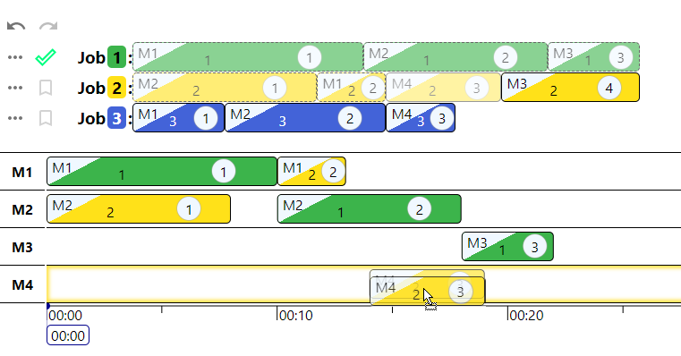

# @michaelyin/job-shop-scheduler
Preview of a drag-and-drop schedule.



## Live Demo

Visit the [Live Demo](https://michaelyinopen.github.io/job-shop-scheduler).

## How to run locally

You'll need [node](https://nodejs.org/) and [yarn](https://classic.yarnpkg.com/en/docs/install).


Install nwb with
```
npm install -g nwb@0.23.x
```

Install packages
```
yarn install
```

Start the demo project with
```
yarn start
```